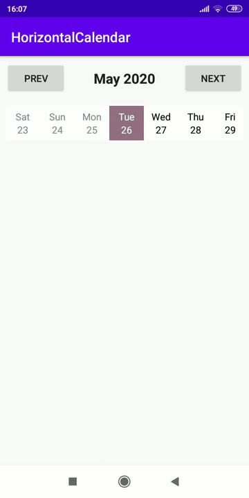

# Horizontal Calendar

This is a primitive horizontal calendar in Android.

## 📚 Introduction
Introducing
A horizontal calendar has been always a cool feature in Android development. I made this calendar so it is easy to understand and you can modify it later. The code is lazy, but for basic it is enough.

## ⚠️ Error and bugs
* Not working on all mobiles due to degradation
* Possible minor bugs
* Code is not the best

## 🛠️ Prerequisites

This app is very old. It is recommended to test it with jdk-15 and beloved. It was created in 2020, so it might not work on every device.

## ⚖️ License

See [LICENSE](LICENSE).
