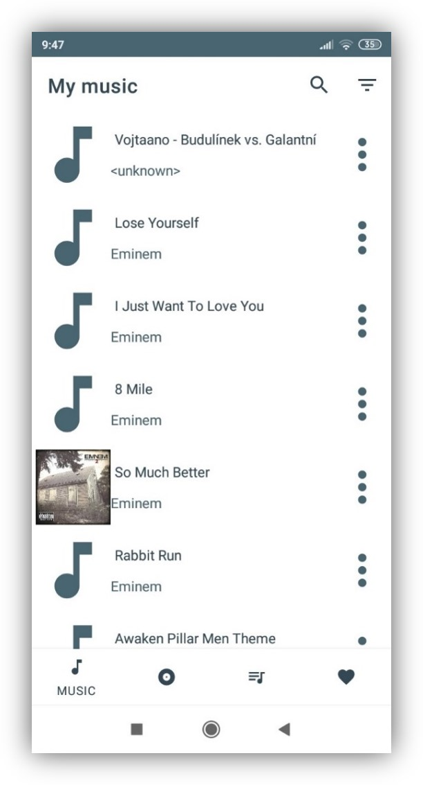
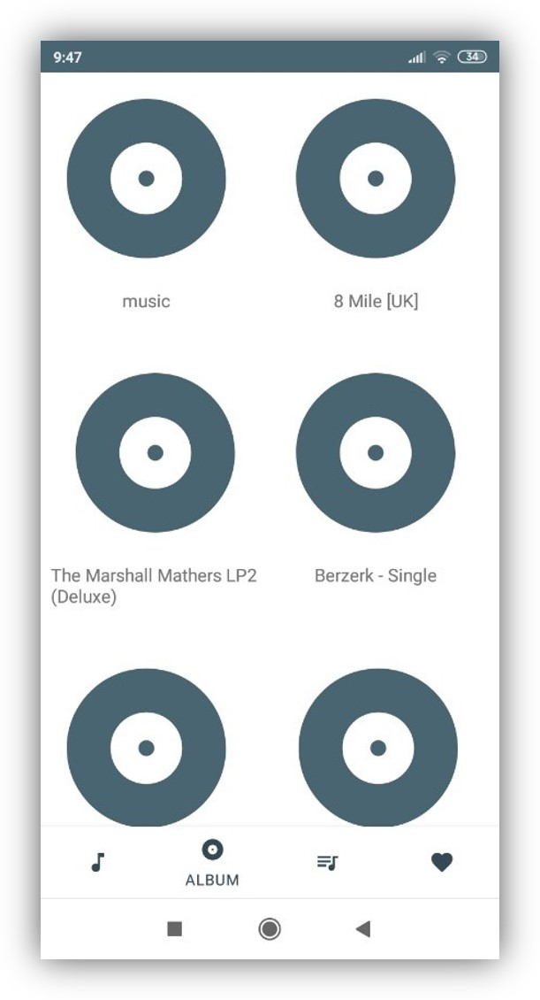
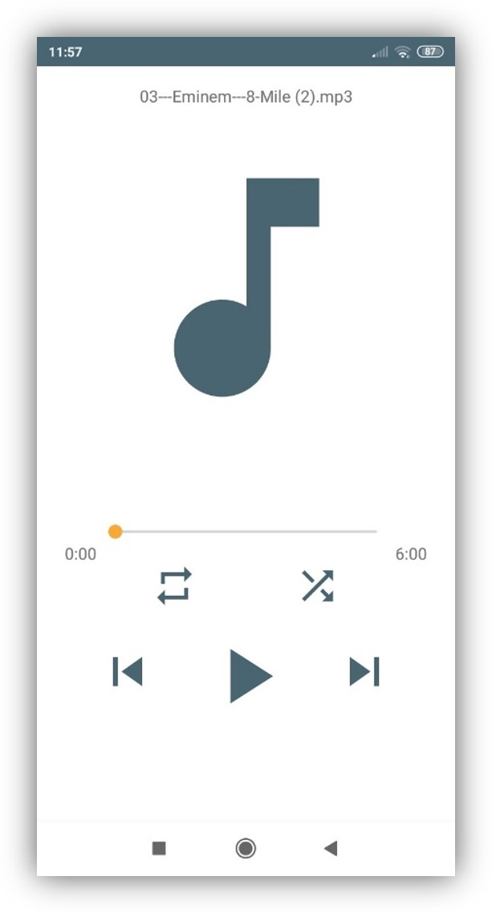

# Music player

This is a primitive music player for Android. It detects MP3 files in a phone and allows you to play them.

## 📚 Introduction
* 4 main layouts for displaying music (home page, by album, by playlist, by favorites)
* Menu for individual music (rename, delete, view details, etc.)
* Add to list or favorites using database
* It uses the latest way of programming Android applications (Navigation, AndroidX, MVVM)

### Main Layout

Main Layout showcase activity with all songs on phone. The second layout shows auto-generated albums. And the third shows how player itself looks like.

    
    
    

## ⚠️ Error and bugs
* Not working on all mobiles
* The SD card is not fully compatible due to degradation
* Possible minor bugs
* Cannot be played in the background

## 🛠️ Prerequisites

This app is very old. It is recommended to test it with jdk-15 and beloved. Although I upgraded this app in 2024, originally it was created in 2017, so it might not work on every device. It had a problem with detecting MP3 files.

## ⚖️ License

See [LICENSE](LICENSE).
